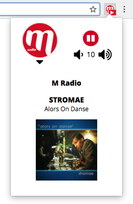

# M Radio browser extension
A browser extension to listen M Radio http://mradio.fr and all its web radios.

## Try it!
To try in Chrome/Chromium:
- clone this repository
- open the Extensions page in Chrome
- enable Developer mode
- click "Load unpacked extension" and select the `src` folder of the cloned repository
- an M Radio red icon should appear at the top-right corner of the browser window, click it and enjoy!

## Features
The extension exposes a browser action (always-visible icon) with playing indicator. Clicking the icon displays a popup with options to
- play/pause audio
- control volume
- see current song (title, artist, cover)
- select web radio (French Touch, Duos etc)

 

## Supported browsers
The initial version supports Chrome only, moving to the common [WebExtensions](https://developer.mozilla.org/en-US/Add-ons/WebExtensions) API should work in Firefox and Edge.

## Test and debug
To debug the extension in Chrome, open the Extensions page in developer mode, find the M Radio extension and click background.html, this should open a developer tools window, check for any error in the console. To debug the popup: open it, right-click anywhere and select Inspect, this should open a new developer tools window.
